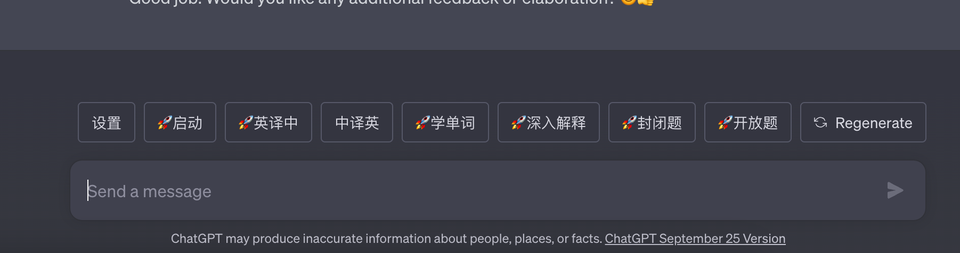
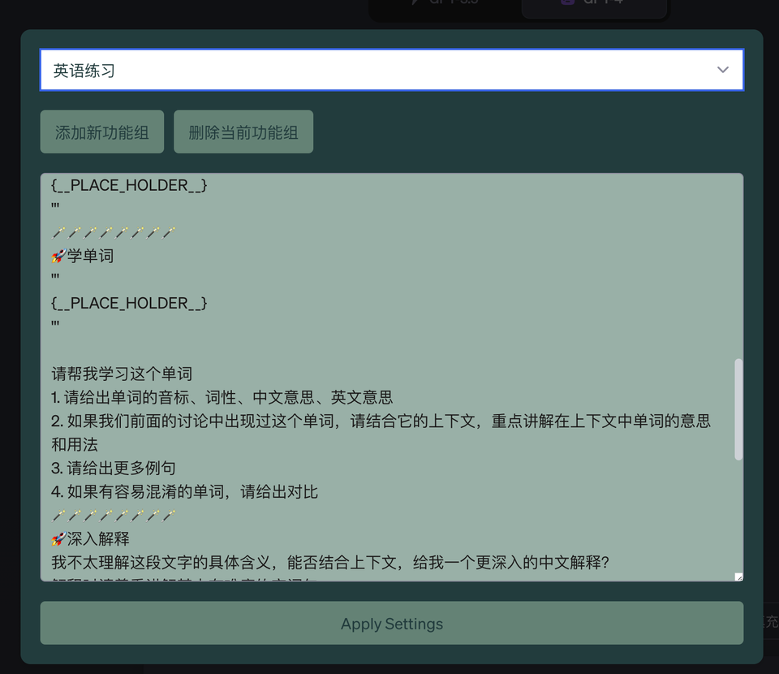

# EasyFill  

添加油猴脚本后在 chat.openai.com 中使用。  
选择你需要的功能组，也可以自己编辑功能 prompt 模版。  

GPT 对话框上方会出现一排按钮  

## 使用方法  
你可以选中页面上任意一段文字，点击按钮，工具就会把你选中的内容填入 {\_\_PLACE_HOLDER\_\_} 的位置并发送  
带🚀的是直接发送，不带🚀的是把模版内容+选中的文本填充到输入框后不直接发送、你还可以继续输入然后再发送  

这个工具的便捷之处，在于你可以方便地选取前面讨论的部分内容，并添加详细指导的 prompt，省去了很多来回 copy&paste 的工作。  
可以参考这个[使用示范](https://chat.openai.com/share/56c0665b-7265-47ac-b40a-774bf3fc557e) 理解工具的用途。请注意那些看着就很麻烦的 prompt 都是自动填充模版生成的。

## 功能组模版说明
目前预置了英语学习功能组。    
欢迎大家补充新的功能组到 tool_templates 下。  
如果你想添加新的功能，只需要把功能组模版粘贴到设置页面里。    

### 文件格式说明：

* 第一行是功能组名称，紧跟着它可以是一些使用说明
* 用 🪄🪄🪄🪄🪄🪄🪄🪄 分隔各个功能组按钮（之所以选择这么奇葩的方式，是为了在一个文件里能够方便写多个 prompt。prompt 啥格式都有，用常规的 json yaml 之类的，写转义字符会写到怀疑人生）
* 🪄🪄🪄🪄🪄🪄🪄🪄 分隔符之后的第一行是按钮名称，然后跟着的就是 prompt 具体内容。
* prompt 中的 {\_\_PLACE_HOLDER\_\_} 会被鼠标选中的页面文字替代掉
* 按钮名称 带🚀的是直接发送（但是如果 {\_\_PLACE_HOLDER\_\_} 没有替代的内容，会光标停留在此处等用户输入后手动发送），不带🚀的会等用户手动发送。

## 联系作者
作者有个公众号：南瓜博士，欢迎关注。

  

本插件感谢豆爸开发的 [关联学习工具](https://waytoagi.feishu.cn/wiki/XMgawFyCVimUSTkeJvHckF9inLc) 给到的启发。