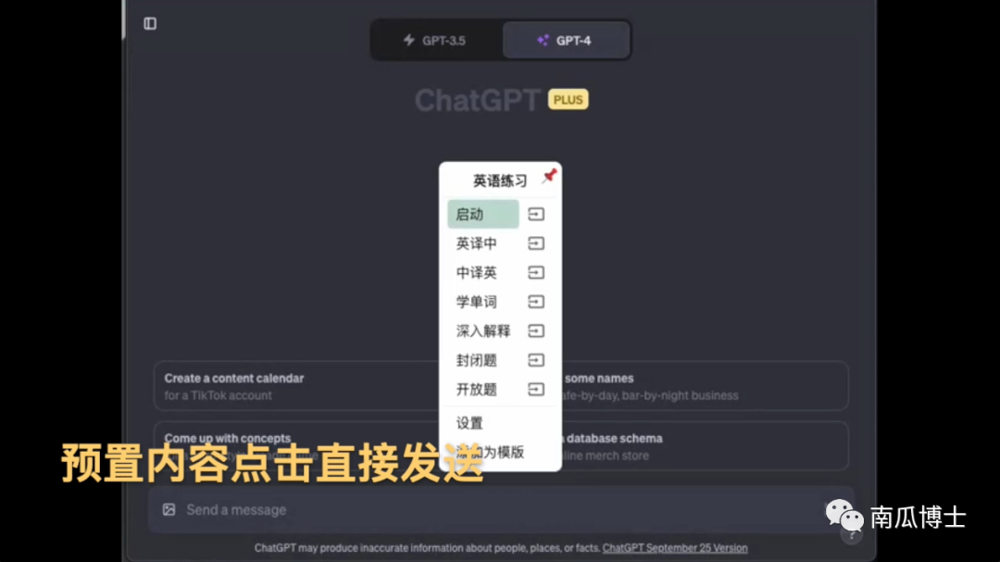
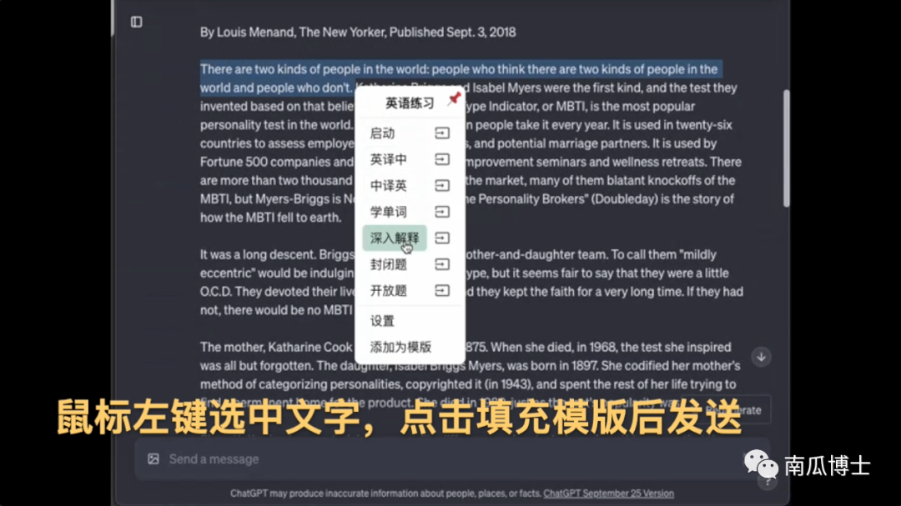
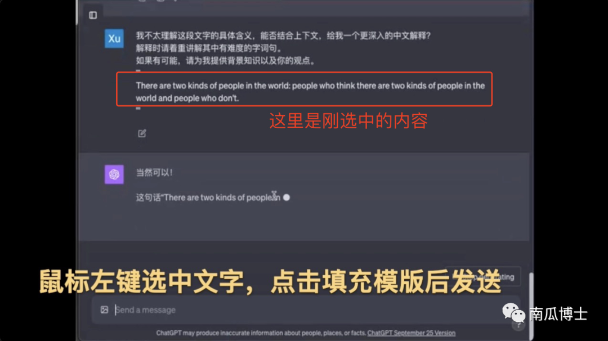
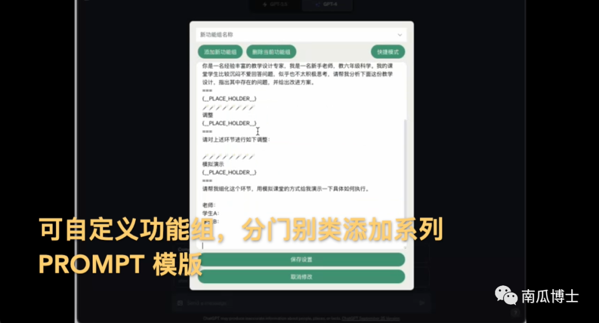
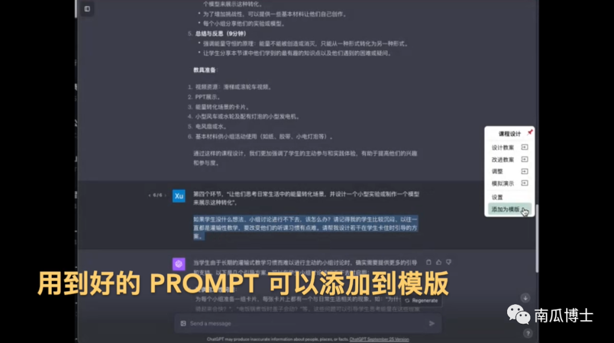
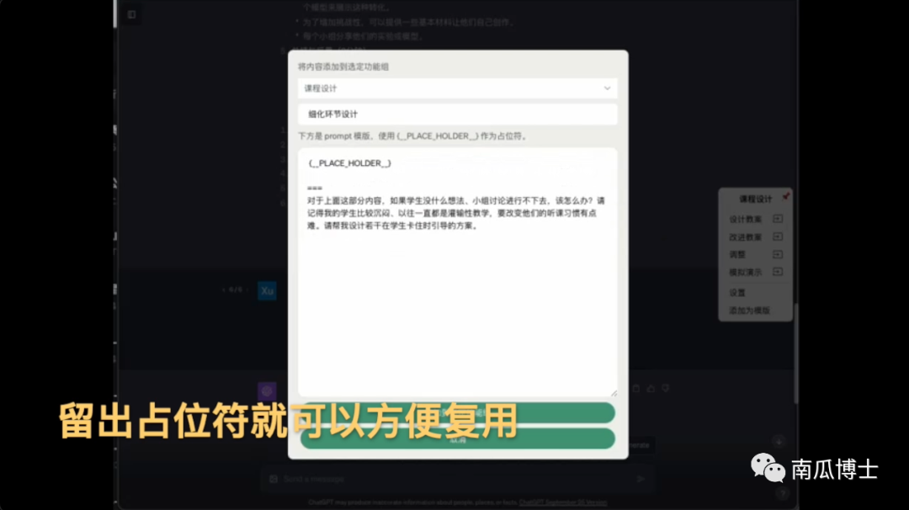
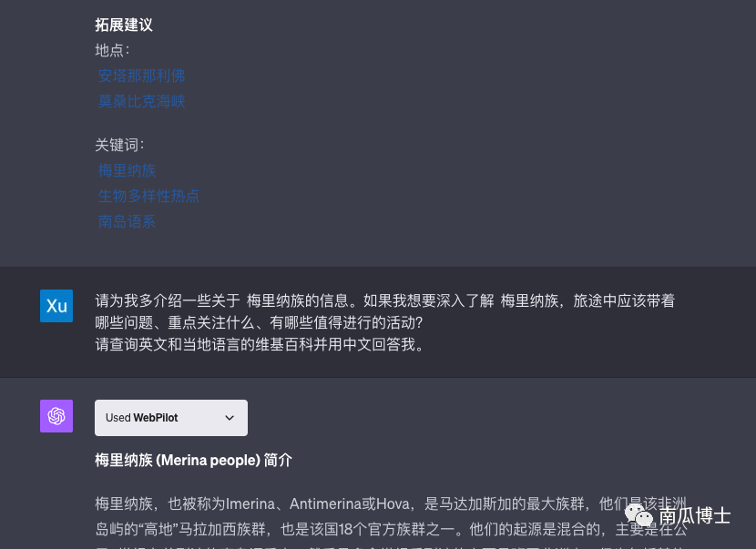
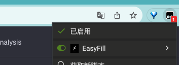
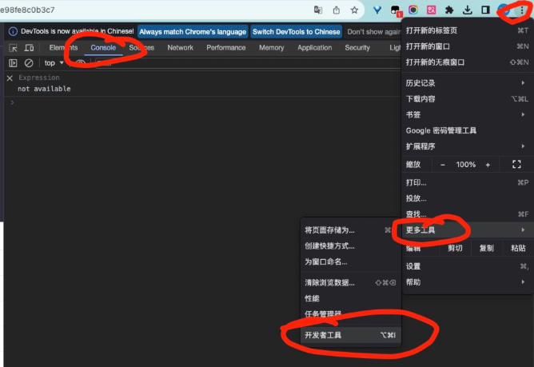

#   EasyFill
这是一个能让你和 GPT 的对话变得无比流畅的小工具。  

将 [Easy Fill 油猴脚本](./easyfill_tampermonkey_script.js) 添加到 Tampermonkey 插件后，在 chat.openai.com 页面开启并使用。  
Chrome Web Store 的插件刚提交，不知道啥时候才能通过审核。也可以先下载 [这个 Chrome 插件](./EasyFillChromExtension.zip) 在“开发者模式”下加载了用。

## 功能概览

https://www.youtube.com/watch?v=1vaokYzMu6c 

1. 通过菜单选择模版发送 Prompt    

2. 将选中的内容填充进模版后再发送    

点选菜单文字按钮是直接发送，如果点右侧的图标则是填充到聊天文本框里，等你编辑后再发送，这样就有机会按需修改了。  

3. 点选菜单文字按钮是直接发送，如果点右侧的图标则是填充到聊天文本框里，等你编辑后再发送，这样就有机会按需修改了。   

4. 把用得不错的 PROMPT 添加为模版    

  
  

5. 将特定格式的文字直接变成可点击项    

**一些小 TIPS**  

1. 点击菜单右上角📌 可以将菜单固定在屏幕右侧。  
2. 在设置里可以切换快捷模式或 Shift 模式。后者需要鼠标选择文字的同时按下 Shift 键才会弹出菜单，避免过多菜单干扰。   
3. 对话中间的对话框处于编辑状态时，如果点选菜单右侧的小按钮，这些编辑框也都会被模版内容填充好。   

## 工具模版示例   

这个工具的最便捷之处，在于你可以方便地选取前面讨论的部分内容，并添加详细指导的 prompt，省去了很多来回 copy&paste 的工作。  
可以参考这个[使用示范](https://chat.openai.com/share/56c0665b-7265-47ac-b40a-774bf3fc557e) 理解工具的用途。请注意那些看着就很麻烦的 prompt 都是自动填充模版生成的。

[这个文件夹](./tool_templates/) 下有一些功能组模版文件，可以复制了粘贴到 设置-》新建功能组 的文本框里。你也可以创建自己的功能组。欢迎大家把自己用得不错的模版贡献到本 repo。  

### 功能组文件格式说明：

* 第一行是功能组名称，紧跟着它可以是一些使用说明
* 用 🪄🪄🪄🪄🪄🪄🪄🪄 分隔各个功能组按钮（之所以选择这么奇葩的方式，是为了在一个文件里能够方便写多个 prompt。prompt 啥格式都有，用常规的 json yaml 之类的，写转义字符会写到怀疑人生）
* 🪄🪄🪄🪄🪄🪄🪄🪄 分隔符之后的第一行是按钮名称，然后跟着的就是 prompt 具体内容。
* prompt 中的 {\_\_PLACE_HOLDER\_\_} 会被鼠标选中的页面文字替代掉。

正则匹配的高级功能：  
* 📖📖📖📖📖📖📖📖 分隔符用于将 GPT 输出的内容转化成可以直接点击的项。📖 一定要在 🪄 之后。  
* 📖📖📖📖📖📖📖📖 之后的第一行是用于匹配文本的正则表达式，然后跟着的就是 prompt 的具体内容。  
* 同样，prompt 中的 {\_\_PLACE_HOLDER\_\_} 会被鼠标选中的页面文字替代掉。通过 📖 方式定义的内容会被直接发送，没有编辑选项。  

## 联系作者

特别欢迎使用插件的伙伴们和我分享你是怎么用的。工具只是便捷操作的一小步，组合了 prompt 设计好的工作流，才是发挥 AI 功力的最重要因素。所以很期待能和大家交流使用心得，也欢迎提需求。  
我有个公众号：南瓜博士，欢迎关注。可以直接在公众号留言，我都会看并回复的。公众号内发送 easyfill 可以加入本工具的讨论群。   
预计我会在收集了一波需求后， 11 月集中更新一版。  

  

## 致谢

本插件特别感谢豆爸开发的 [关联学习工具](https://waytoagi.feishu.cn/wiki/XMgawFyCVimUSTkeJvHckF9inLc) 给到的启发。  
菜单交互的代码是由豆爸贡献的，菜单和对话框的样式是豆爸做的，📖 直接点击发送的功能也来自于关联学习工具的需求。  

还要特别感谢 GPT 和 Github Copilot，作为一名完全搞不懂 css 的前端渣，90% 的代码都是它们写的，我只负责提问题和搬运。（当然，错误也是它们犯的，有不好看的代码找它们吐槽去。）    

## 特别说明  
目前我只在电脑上 Chrome 浏览器的油猴插件里测试过，别的环境我不了解，可能暂时还支持不了。  
脚本本身不需要特别权限，我特意避开了需要跨域等特殊权限的功能，理论上安装后应该能正常运行。  
[安装使用教程请看这里](https://mp.weixin.qq.com/s/zLVEH9wgi2So4-Lm3Prhmw)

如果电脑上的 Chrome 安装后仍旧看不到效果：  
1. 确认脚本已启用：在 https://chat.openai.com/ 的网页上你应该能看到这个脚本可用，确保它是开启的。  

2. 强制刷新页面（Ctrl/Cmd + Shift + R）

3. 如果还是看不到效果，有可能是你之前粘贴脚本的时候不小心敲了个字母之类的导致脚本出错，请重新粘贴一遍脚本。

4. 如果还是不行，请从浏览器右上角菜单-》更多工具-》开发者工具-》console 里找一下有什么出错信息。也许和别的插件或脚本冲突了。  

  

Chrome 插件版本请稍再等等。

